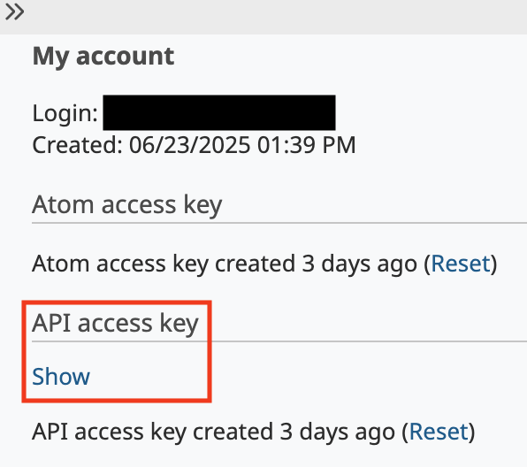
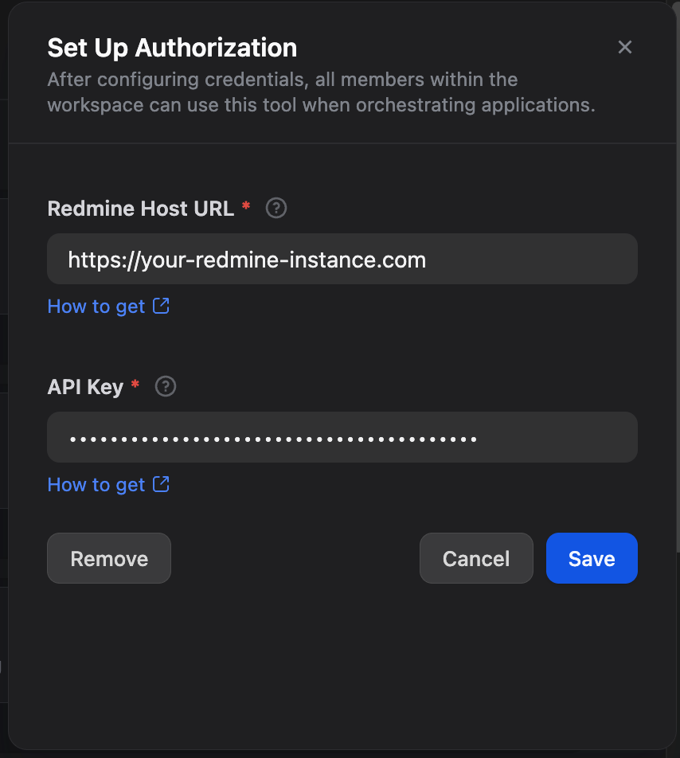

# Redmine Plugin for Dify

**Author:** yasu89
**Version:** 0.0.2
**Type:** Tool Provider Plugin
**Repository:** https://github.com/yasu89/redmine-dify-plugin

## Description

The Redmine Plugin for Dify provides comprehensive integration with Redmine project management systems.

## Tools

### OUTPUT VARIABLES

All tools provide consistent output in multiple formats:

1. **Text Output**: Complete raw API response data from Redmine in text format
2. **JSON Output**: Complete raw API response data from Redmine in JSON format
3. **File Output**: Attachment files when applicable (available with `get_issues`/`get_issue` when attachments are included)

### 🎯 Issue Management
- **Get Issues** (`get_issues`): Retrieve and filter multiple issues with advanced search capabilities
    - **Special Feature**: Automatically downloads attachment files when `attachments` is specified in the `Include Additional Data` parameter
- **Get Issue** (`get_issue`): Fetch detailed information about a specific issue, including attachments
    - **Special Feature**: Automatically downloads attachment files when `attachments` is specified in the `Include Additional Data` parameter
- **Create Issue** (`create_issue`): Create new issues with comprehensive parameter support
- **Update Issue** (`update_issue`): Modify existing issues with comprehensive field updates

### 👥 User Management
- **Get Users** (`get_users`): List and filter users (requires admin privileges)
- **Get User** (`get_user`): Retrieve detailed information about a specific user, including support for the current user
- **Create User** (`create_user`): Create new users with password management options (requires admin privileges)
- **Update User** (`update_user`): Update user information and manage admin privileges (requires admin privileges)

## Setup Instructions

### 1. Enable REST API in Redmine
1. Log into your Redmine instance as an administrator
2. Go to **Administration** → **Settings** → **API**
3. Check **Enable REST API**
4. Go to your account page (`/my/account`)
5. Get your API key on the right-hand pane of the default layout

See also: https://www.redmine.org/projects/redmine/wiki/rest_api#Authentication

### 2. Configure the Plugin in Dify
1. Select the **Redmine** plugin
2. Setup Authorization
    - **Redmine Host URL**: Enter the URL of your Redmine instance
    - **API Key**: Enter your Redmine API key from the previous step
3. Click **Save** button

## API Compliance

This plugin is fully compliant with the official Redmine REST API:
- [Redmine REST API Documentation](https://www.redmine.org/projects/redmine/wiki/Rest_api)
- [Issues API](https://www.redmine.org/projects/redmine/wiki/Rest_Issues)
- [Users API](https://www.redmine.org/projects/redmine/wiki/Rest_Users)

## Privacy Policy

See [Privacy Policy](./PRIVACY.md)

## License

[MIT License](./LICENSE)
